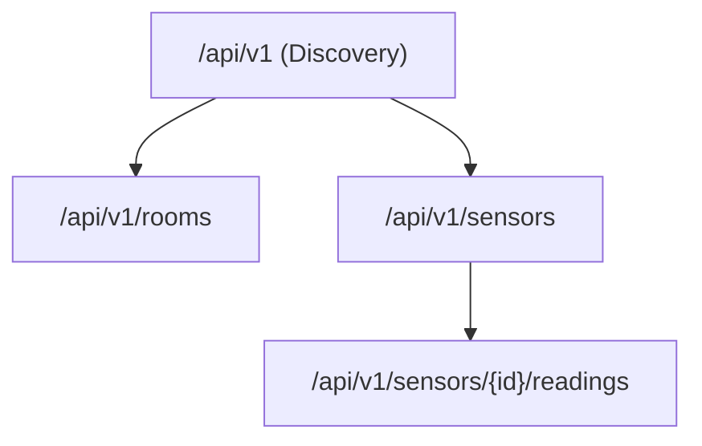

# 🏫 Smart Campus — Sensor & Room Management API

A robust, scalable RESTful API built with **Jakarta RESTful Web Services (JAX-RS)** for the University of Westminster "Smart Campus" initiative. This system manages thousands of campus rooms and their diverse sensor arrays (CO2, occupancy, temperature, etc.) using an in-memory data store.

## 🚀 Getting Started

### Prerequisites
- **Java 11** or higher
- **Maven 3.9.x**
- **Apache Tomcat 9+** (for deployment)

### Build & Deployment
1. **Clone the repository:**
   ```bash
   git clone <repository-url>
   cd Smart-Campus-API
   ```

2. **Build the WAR file:**
   ```bash
   mvn clean package
   ```
   This generates `target/Smart-Campus-API.war`.

3. **Deploy to Tomcat:**
   - Copy `target/Smart-Campus-API.war` to your Tomcat's `webapps/` directory.
   - Start Tomcat (`bin/startup.bat` on Windows).

4. **Access the API:**
   The base URL will be: `http://localhost:8080/Smart-Campus-API/api/v1`

---

## 🛠️ API Overview & Resource Hierarchy

The API follows a logical hierarchy reflecting the physical structure of the campus:



- **Discovery Resource**: Entry point providing administrative data and navigation links.
- **Room Resource**: Management of physical spaces (ID, Name, Capacity).
- **Sensor Resource**: Management of IoT hardware (Type, Status, CurrentValue).
- **Sensor Reading Resource**: Historical log of measurements for each sensor.

---

## 🧪 Sample Interactions (curl)

### 1. Discover API Entry Point
```bash
curl -X GET http://localhost:8080/Smart-Campus-API/api/v1
```

### 2. Create a New Room
```bash
curl -X POST http://localhost:8080/Smart-Campus-API/api/v1/rooms \
     -H "Content-Type: application/json" \
     -d '{"id": "LIB-301", "name": "Library Quiet Study", "capacity": 50}'
```

### 3. Register a Sensor to the Room
```bash
curl -X POST http://localhost:8080/Smart-Campus-API/api/v1/sensors \
     -H "Content-Type: application/json" \
     -d '{"id": "TEMP-001", "type": "Temperature", "status": "ACTIVE", "roomId": "LIB-301"}'
```

### 4. Filter Sensors by Type
```bash
curl -X GET http://localhost:8080/Smart-Campus-API/api/v1/sensors?type=Temperature
```

### 5. Append a Sensor Reading
```bash
curl -X POST http://localhost:8080/Smart-Campus-API/api/v1/sensors/TEMP-001/readings \
     -H "Content-Type: application/json" \
     -d '{"value": 22.5}'
```

---

## 📝 Conceptual Report (Answers to Questions)

### Part 1: Service Architecture
**Q1.1: JAX-RS Resource Lifecycle & Data Synchronization**
By default, JAX-RS resources use a **per-request** lifecycle, meaning a new instance is created for every incoming request. This design promotes statelessness and prevents memory leaks. However, it means any in-memory data (like Maps or Lists) stored as instance variables would be lost between requests. To solve this, we use a **Singleton DataStore** (with `ConcurrentHashMap`) that persists throughout the application's lifetime, ensuring that all resource instances share a single, thread-safe state.

**Q1.2: The Hallmark of Advanced REST (HATEOAS)**
HATEOAS (Hypermedia as the Engine of Application State) provides clients with dynamic links in responses, allowing for "self-discovery." This approach makes the API resilient to URI changes and reduces the coupling between the client and the specific URL structure. Client developers can follow links (like `"rooms" -> "/api/v1/rooms"`) instead of relying on hardcoded strings or static documentation.

### Part 2: Room Management
**Q2.1: Returning IDs vs. Full Objects in Lists**
Returning only IDs reduces network bandwidth and speeds up the initial response, as the payload is much smaller. However, it forces the client to make multiple follow-up requests to fetch details for each item ("N+1 problem"). Returning full objects is heavier on the network but allows the client to render all information in a single pass, which is often preferred for dashboards or list views.

**Q2.2: Idempotency of the DELETE Operation**
In this implementation, DELETE is **idempotent**. The first request successfully deletes the room. Subsequent identical requests will return a `404 Not Found` (as the resource is already gone). While the status code changes (204 vs 404), the **state of the server** remains the same (the room is gone), which satisfies the definition of idempotency.

### Part 3: Sensor Operations
**Q3.1: Content-Type Mismatch Handling**
The `@Consumes(MediaType.APPLICATION_JSON)` annotation acts as a filter. If a client sends data in an unsupported format like `text/plain`, JAX-RS will automatically reject the request before it even hits the resource method, returning an **HTTP 415 Unsupported Media Type** error.

**Q3.2: Query Parameters vs. Path Segments for Filtering**
Query parameters (`?type=CO2`) are superior for filtering because they are optional and do not change the base resource identification. Using path segments (`/sensors/type/CO2`) implies that "type" and "CO2" are distinct hierarchical levels of resources, which they are not. Filtering is a cross-cutting operation that should not alter the structure of the URI.

### Part 4: Sub-Resources
**Q4.1: Benefits of the Sub-Resource Locator Pattern**
Sub-resource locators allow us to delegate logic to separate classes (like `SensorReadingResource`), keeping individual files small and focused. Defining every nested path in a single class leads to "God Classes" that are hard to maintain and test. Delegating based on path segments improves modularity and readability.

### Part 5: Error Handling & Logging
**Q5.2: HTTP 422 vs. 404 for Missing References**
HTTP 422 (Unprocessable Entity) is more semantically accurate than 404 when the client provides a valid JSON payload that refers to a non-existent parent ID. A 404 typically implies the entire URI path is wrong, whereas 422 indicates that the request was understood and formatted correctly, but the *business logic* (referential integrity) failed.

**Q5.4: Cybersecurity Risks of Stack Traces**
Exposing Java stack traces is a major vulnerability. It reveals internal class names, library versions, database schemas, and even file paths. An attacker can use this information to identify specific software versions with known CVEs or to understand the application's internal logic to craft targeted exploits (like SQL injection or RMI attacks).

**Q5.5: Benefits of JAX-RS Filters for Logging**
Using filters encapsulates cross-cutting concerns in a single place (DRY principle). If we manually logged in every method, it would lead to code duplication and missing logs if a developer forgets a statement. Filters ensure that **every** request and response is logged consistently without cluttering the business logic rooms.

---

## 📺 Video Demonstration
The Postman walkthrough video is uploaded directly to BlackBoard.
- **Duration**: ~8 minutes
- **Scope**: All CRUD operations, type filtering, error handling (403, 404, 409, 422, 500).
